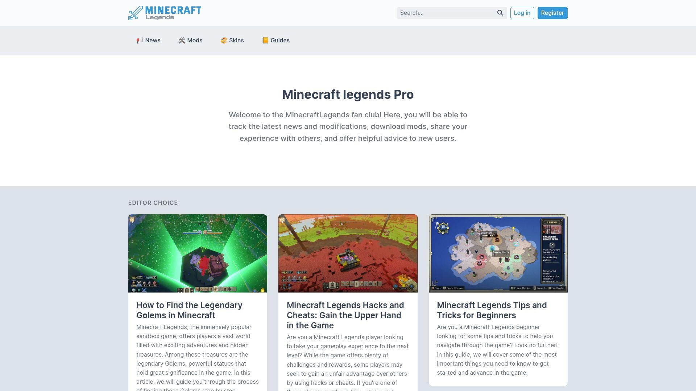
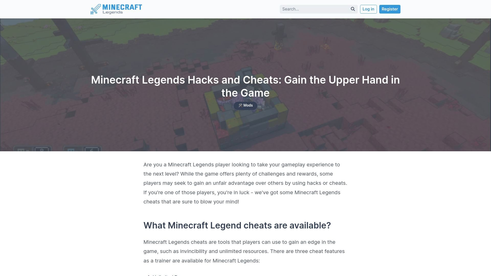

# MinecraftLegends Pro

MinecraftLegends Pro is a powerful and flexible blogging engine built on **Laravel 10** and integrated with **Editor.js**. Initially developed as a dedicated blog platform for the **Minecraft Legends** game, the project has since evolved into an open-source solution for general blogging needs after the game’s decline. Now, **MinecraftLegends Pro** is available for developers to use in their own projects, offering an easy-to-set-up, feature-rich blogging engine that can be customized to suit a variety of needs.

This blog engine is perfect for content creators, communities, and developers looking to launch a content-driven platform. With its clean and modern interface built on **Bootstrap 5** and powerful **permissions management**, it’s ready to scale for various types of blogs and websites.

## Features

- **Built on Laravel 9**
- **Editor.js Integration**
- **Admin Panel**
- **Permissions Management**
- **Bootstrap 5**
- **Easy Setup**

## Installation

To get started with MinecraftLegends Pro, follow these installation steps:

1. **Clone the repository**:
   ```bash
   git clone https://github.com/therezor/minecraftlegends.pro.git
   cd minecraftlegends.pro
   ```

2. **Install Composer dependencies**:
   ```bash
   composer install
   ```

3. **Set up your environment file**:
   ```bash
   cp .env.example .env
   ```

4. **Configure your database**: Open the `.env` file and set up your database connection details.

5. **Run the migrations and seed the database**:
   ```bash
   php artisan migrate --seed
   ```

   This command will also create an admin account with the following credentials:
    - Email: `admin@admin.com`
    - Password: `12345678`

## Console Commands

To help you maintain the codebase and ensure consistency, use the following console commands:

- **Run tests**:
  ```bash
  composer test
  ```

- **Automatically fix code style**:
  ```bash
  composer fix-style
  ```

- **Check code style**:
  ```bash
  composer check-style
  ```

## Story Behind the Project

**MinecraftLegends Pro** was initially designed as a blog engine for the Minecraft Legends game, aimed at creating a platform for the game’s community to share news, guides, fan content, and more. The blog was meant to be a central hub for fans, where they could discuss updates and strategies related to the game.

Unfortunately, after the game's failure, the project was left without a purpose. However, seeing the potential in the underlying code, I decided to open-source the project and make it available to developers who are in need of a flexible and easy-to-use blogging platform. Now, you can use **MinecraftLegends Pro** for your own projects, whether it's a personal blog, a community-driven site, or a content hub.


## Screenshots

Here are some screenshots showcasing the features and interface of **MinecraftLegends Pro**:




## Keywords
- **Laravel Blog**
- **Blogging Engine**
- **Open-source Blog**
- **Laravel 10**
- **Content Management System**
- **Editor.js Integration**
- **Blogging Platform**
- **Permissions Management**
- **Bootstrap 5 Blog**
- **PHP Blog System**
